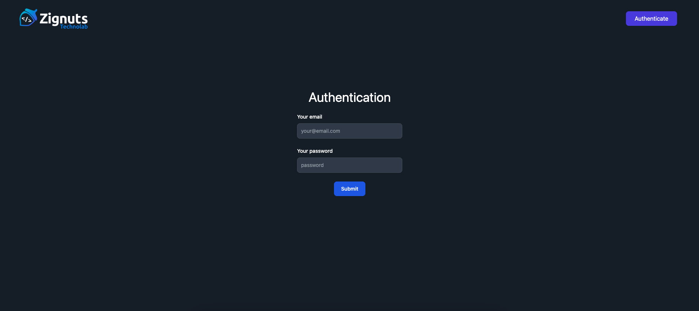

# JWT-Authentication in MERN Stack

Welcome to the JWT Authentication with MERN Stack project. Follow the steps below to set up and run the project.

## About this Project

This project presents a straightforward authentication system utilizing JSON Web Tokens (JWT) for user authentication. It provides insights into real-world authentication scenarios using MERN Stack. Additionally, the project demonstrates the process of token signing and verification on the server side.

## Technologies Used

This project leverages a variety of technologies to achieve its goals. Some of the key technologies include:

- **React.js**
- **Node.js**
- **Express**
- **MongoDB**
- **JSON Web Tokens (JWT)**

## Clone the Repository

Clone the Git repository to your local machine:

```bash
git clone https://github.com/kasifzignuts7/JWT-Authentication
```

## Install Dependencies

Navigate to the project directory and install the required dependencies:

```bash
npm install
```

This will generate a "node_modules" folder in your root directory.

```bash
cd client
npm install
```

## Configuration

1. Replace the placeholder `MyStrongSecretKey` in the code with a strong, unique secret key for signing and verifying JWTs.

2. If using a remote MongoDB URL, replace `mongodb://127.0.0.1:27017/JWTAuth` with your connection URL.

## Running the Application

After configuring the application, run the following command:

For server:

```bash
nodemon index.js
```

For client:

```bash
npm start
```

Visit `http://localhost:3000` in your browser to interact with the JWT authentication demo. The application provides routes for authentication and protected page.

## Usage and Testing

1. Click on the submit button to authenticate.
2. Once authenticated, you will be redirected to the private page.
3. Open the developer tools in your browser and navigate to Application -> Storage -> Cookies to view the JWT token.
4. Even after closing the tab or browser, you'll remain logged in, demonstrating the token's persistence.
5. To logout, click on the logout button. This will clear the JWT token from your cookie and redirect you to the homepage.

### Screenshots

#### Description:

- This is a snapshot gives us broad picture of how authentication works in action.


#### Homepage:



#### Private page:


## Conclusion

Feel free to explore, modify, and enhance the code for your specific requirements. Happy coding!
